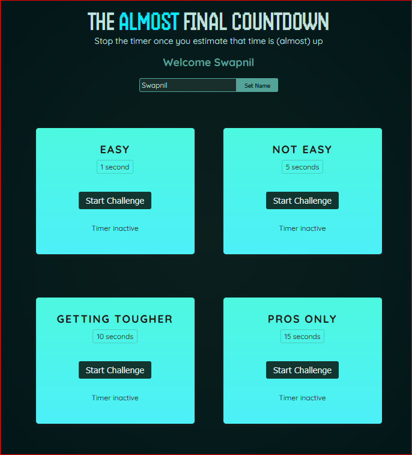

# React Projects Collection

This repository contains multiple React projects built for learning, experimenting, and practicing front-end development.

---

## 🚀 Live Projects

### 1️⃣ **Countdown Game**
A fun timer challenge game where you must stop the timer as close to zero as possible.

👉 **Live Demo:** [https://countdowngame.vercel.app](https://react-projects-swart-gamma.vercel.app/)  
📁 **Project Folder:** `/countDownGame`



---

## 📦 Projects Included

| Project Name | Description | Folder |
|--------------|-------------|--------|
| Countdown Game | A timer accuracy challenge game | `/countDownGame` |
| Tic Tac Toe | Basic tic tac toe practice project | `/07-tic-tac-toe-starting-project` |

---

## 🛠 How to Run Any Project

1. Open the project folder  
2. Install dependencies:  
   ```bash
   npm install
3. Start project:
   ```bash
   npm start
  
